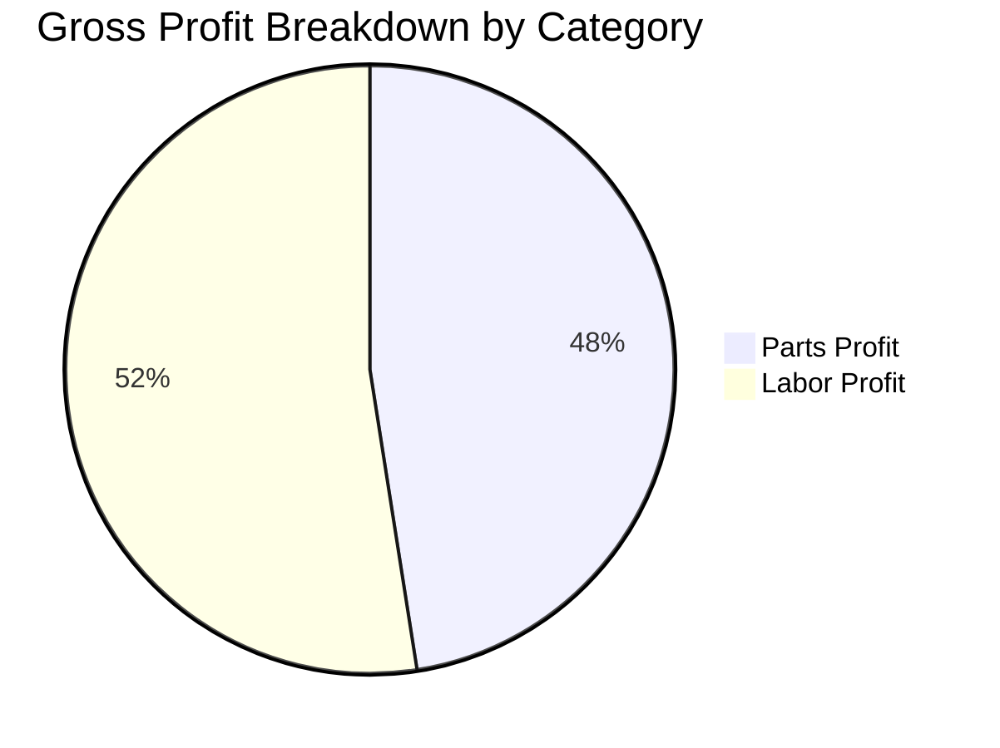
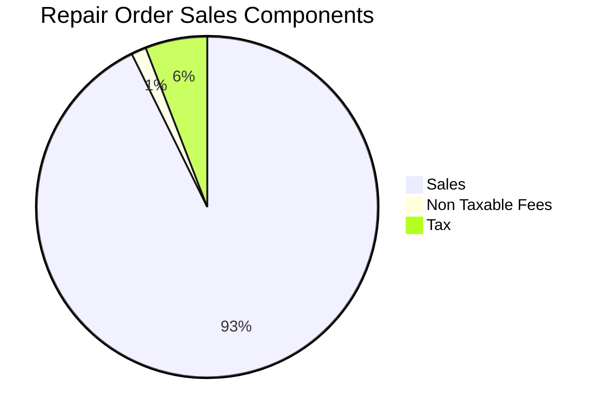
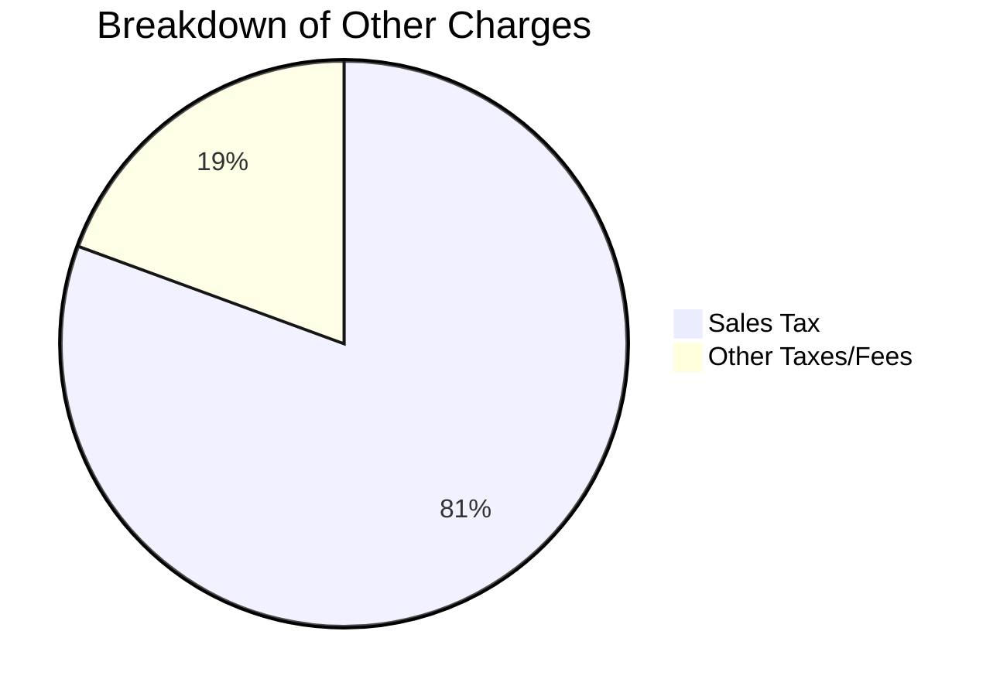
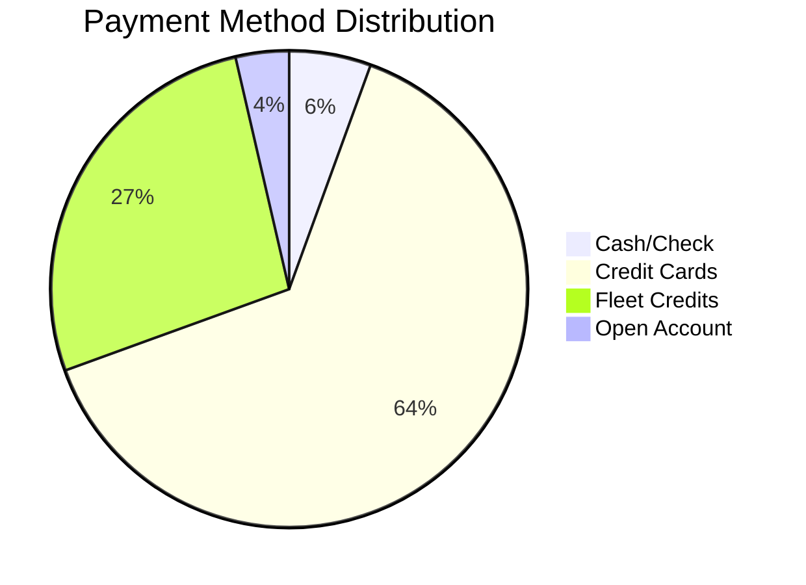
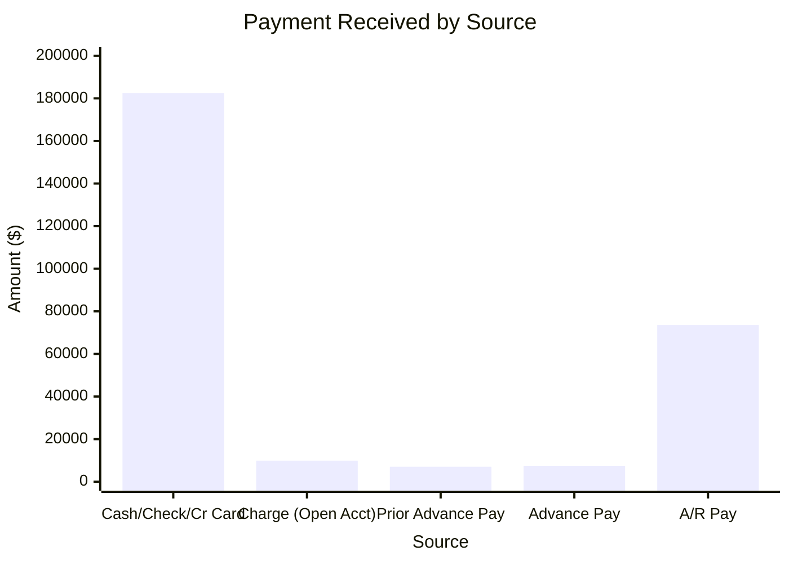
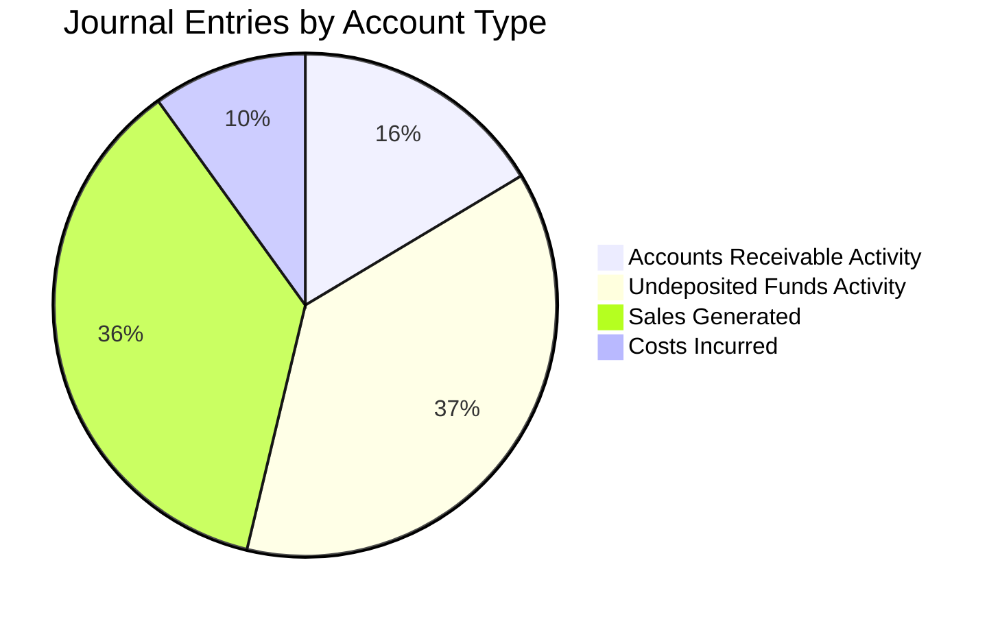

# PACIFIC GLOBAL Newsletter - 2025-08-20

## Gross Profit Analysis

This section analyzes the Gross Profit data, which is crucial for understanding the financial health of our repair orders.

**Key Metrics and Trends:**
The Gross Profit data reveals a total sales of **$184,822.18** with a corresponding cost of **$50,557.63**, yielding a total profit of **$134,264.55** and an impressive gross profit margin of **72.65%**. Labor contributions show a 100% margin, highlighting its profitability, while parts sales also contribute significantly despite higher costs.

**Actionable Insights:**
To maintain and enhance profitability, we should continue to optimize labor efficiency and explore better vendor pricing for parts. Given the significant contribution of labor to our gross profit, investing in technician training and efficient scheduling can further improve our bottom line.

**Gross Profit Distribution by Category**

## RO Summary Analysis

The RO Summary provides an overview of all repair orders, including their status and key financial figures.

**Key Metrics and Trends:**
During this period, we processed a total of **645 Repair Orders**. The average sale per R.O. before tax was **$286.55**, increasing to **$309.06** with tax included. Our total RO Sales reached **$199,344.98**, comprising Sales, Non Taxable Fees, and Tax.

**Actionable Insights:**
Monitoring the number of ROs and average sale value provides insights into our operational volume and pricing effectiveness. Focus on strategies to slightly increase the average sale per RO through upselling or value-added services. Ensure timely collection of all components of RO sales to maintain healthy cash flow.

**RO Sales Components Distribution**

## Other Charges Analysis

This section focuses on charges outside of standard repair order items, such as miscellaneous fees or special service charges.

**Key Metrics and Trends:**
Other charges contributed **$14,522.80** to our total sales. This primarily consists of **Sales Tax ($11,704.62)** and **Other Taxes/Fees ($2,818.18)**, indicating compliance and standard operational charges.

**Actionable Insights:**
Given that 'Other Charges' are mainly composed of statutory taxes and fees, ensure accurate and timely remittance to avoid penalties. Clearly communicating these charges to customers at the time of service helps transparency and satisfaction. Reviewing the nature of 'Other Taxes/Fees' periodically can identify opportunities for reclassification or clearer categorization.

**Breakdown of Other Charges**

## Payment Types Analysis

Understanding the different methods customers use to pay helps in optimizing payment processing and identifying preferred payment channels.

**Key Metrics and Trends:**
Our total payments amounted to **$273,363.29**. The vast majority of payments were received via **VISA/MASTERCARD ($172,980.78)**, followed by **Fleet Credits ($73,597.13)**. Cash and Check payments combined for **$15,180.25**, while EasyPay and Discover contributed smaller amounts. Charge (Open Acct) represents **$9,893.50**.

**Actionable Insights:**
The high volume of credit card transactions suggests a need for efficient and secure electronic payment processing systems. Encourage the use of electronic payment methods where transaction fees are favorable. For fleet credits and open accounts, ensure clear terms and prompt invoicing to accelerate collections.

**Payment Method Distribution**

## Payment Summary Analysis

The Payment Summary provides an aggregate view of all incoming payments, their dates, and associated repair orders.

**Key Metrics and Trends:**
The payment summary shows a total of **$273,363.29** in collected funds. This includes **$182,438.43** from Cash/Check/Credit Card, **$9,893.50** from Charge (Open Acct), and a significant **$73,597.13** from A/R Pay, indicating successful collection of outstanding receivables. Advance payments (Prior Advance Pay and Advance Pay) also play a role in managing cash flow.

**Actionable Insights:**
The substantial amount from A/R Pay highlights effective collection efforts. Continue to monitor the aging of receivables and implement proactive follow-up for outstanding balances. Analyze the components of 'Total Other Pay' to understand non-RO related income streams.

**Payment Received by Source**

## Journal Entries Analysis

Journal entries are the backbone of our financial records, detailing every transaction.

**Key Metrics and Trends:**
Analysis of journal entries shows significant activity in **Undeposited Funds ($189,872.66 in debits)**, reflecting incoming payments awaiting deposit. **Accounts Receivable activity totals $83,490.63**, indicating both charges and collections. Total **Sales Generated are $184,822.18**, and **Costs Incurred are $50,557.63**. These entries provide a comprehensive view of the financial transactions, from revenue generation to cost recognition and cash management.

**Actionable Insights:**
Regularly reconcile Undeposited Funds with bank statements to ensure accurate cash reporting. Closely monitor Accounts Receivable entries for any discrepancies that might impact collection efforts or financial reporting accuracy. Ensure all sales and cost entries are correctly categorized to reflect true profitability.

**Journal Entry Distribution by Account Type**

Regards,
Insights Team
PACIFIC GLOBAL
