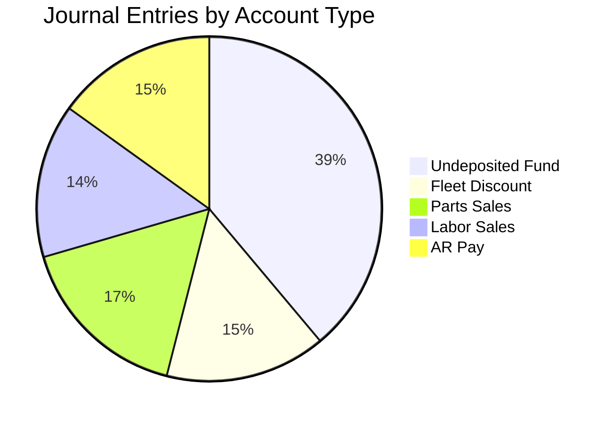

Journal entries are the backbone of our financial records, detailing every transaction.

**Key Metrics and Trends:**
The journal entries show significant activity across various accounts. Undeposited funds total $189,872.66 from checks, cash, and credit card payments. Accounts Receivable has a debit of $9,893.50 for Charge Pay and a credit of $73,597.13 for AR Pay, indicating collections. Revenue accounts include Parts Sales ($80,618.71), Tire Sales ($33,745.26), and Labor Sales ($70,458.21). Expense accounts include Parts Costs ($28,970.99) and Tire Cost ($21,586.64).

**Actionable Insights:**
Regularly review journal entries for accuracy and compliance. The "Undeposited Fund" entries highlight the importance of timely bank deposits to match these recorded transactions. The "Accounts Receivable" entries demonstrate active management of outstanding balances. It is important to continue to reconcile "Sales Tax Payable" and "Tire Tax" to ensure compliance with tax regulations.

**Journal Entry Distribution by Account Type (Top 5)**

Regards,
Insights Team
PACIFIC GLOBAL